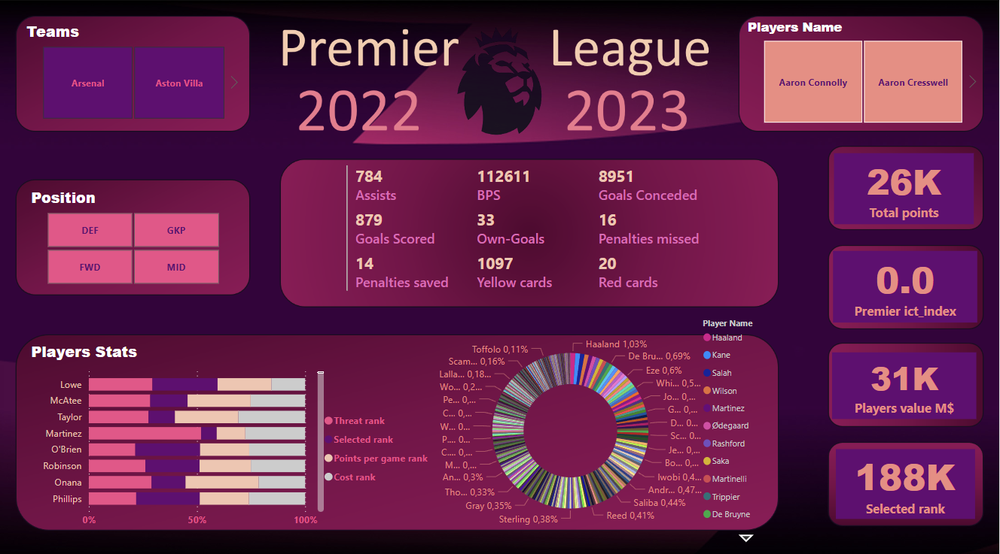

# Data Analyst | Power BI Developer | Sports Analytics Enthusiast 🏆⚽

Passionate about transforming raw data into actionable insights. Experienced in leveraging Power BI to visualize complex sports data, with a recent focus on the Premier League 2022/2023 season.

## Project Highlight
Designed and developed a comprehensive Power BI dashboard that presents real-time performance metrics of Premier League players. The interactive dashboard features:
- Dynamic visualizations of player rankings based on various points categories set by the Premier League.
- In-depth breakdowns of assists, red and yellow cards, contributing to a holistic view of player contributions.
- Advanced comparison tools, enabling users to analyze players' performance against their peers.
- User-friendly interface for seamless navigation and exploration of player statistics.

## Key Achievements
✅ Successfully collected, cleaned, and integrated complex player data from multiple sources.
✅ Translated data insights into impactful visualizations, aiding coaches, analysts, and fans in making informed decisions.
✅ Received positive feedback for the user-centered design, making statistical analysis accessible to a wider audience.
✅ Demonstrated strong collaboration skills by working closely with sports analysts to understand their needs and tailor the dashboard accordingly.

## Looking Forward
Passionate about continuous learning, I'm excited to further refine my skills in data visualization, sports analytics, and user experience design. Open to new opportunities that allow me to contribute my expertise to exciting projects in the sports analytics landscape.

Let's connect! I'm eager to engage with fellow data enthusiasts, sports aficionados, and professionals in the analytics community.
